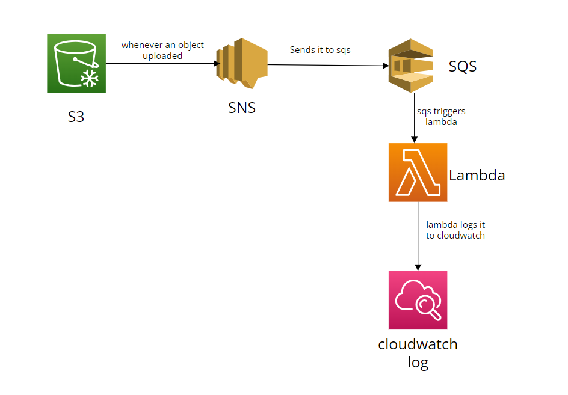

# Welcome to your CDK TypeScript project

This is a blank project for CDK development with TypeScript.

The `cdk.json` file tells the CDK Toolkit how to execute your app.

## Useful commands

- `npm run build` compile typescript to js
- `npm run watch` watch for changes and compile
- `npm run test` perform the jest unit tests
- `npx cdk deploy` deploy this stack to your default AWS account/region
- `npx cdk diff` compare deployed stack with current state
- `npx cdk synth` emits the synthesized CloudFormation template

## What about this project

We are creating following resources using cdk

- S3
- SNS
- SQS
- Lambda

```txt
s3 is confgiured with sns event, so whenever an object uploaded to s3, which will notify to sns.
sns is configured with sqs,  So what ever sns is published will be sent to sqs
sqs is configured to trigger event with sqs obj
lambda logs the sqs event in cloudwatch log
```

## Diagram


