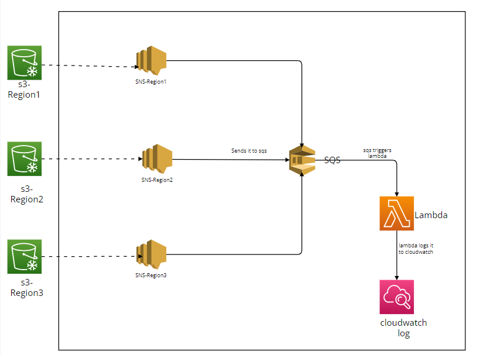

# SNS Notification serverless:

In this we are creating three sns topics in different regions. The sns's are configured to sqs so
that whenever sns got a message that will be directed to sqs. The Sqs will be configured to lambda and
the lambda logs to cloud-watch log.

